👨‍💻👨‍💻👨‍💻 Welcome to AI World, 👨‍💻👨‍💻👨‍💻

### Hi 👋, I'm Arjun Kashyap

I'm an AI + Cloud Developer from Sonipat, India.

🌱 I’m currently Work on Artificial Intelligence

💬 Ask me about Python, System Design, SQL, Machine Learning, Deep Learning, NLP, Generative AI, Agentic AI, AI Agents, AI Architecture

📫 Reach me at kashyaparjun083@gmail.com

---

### 🤖 Python Tools:

  
  
   
  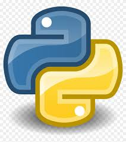
  
  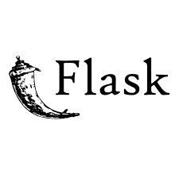
  
  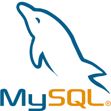

---
---

### 🤖 Data Analysis Tools:

  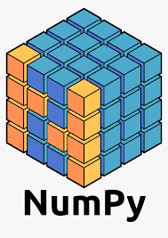
  

---
---

### 🤖 Data Visualization Tools:

  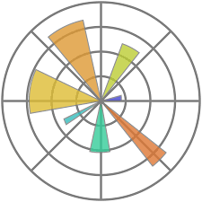
  
  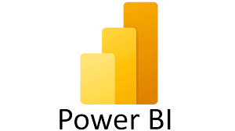

---
---

### 🤖 Prediction Tools:

  
  
  
  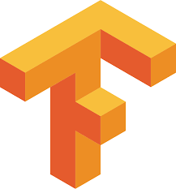
  
  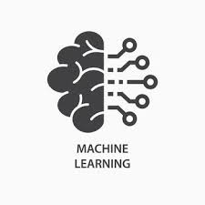
  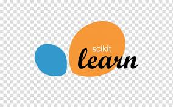
  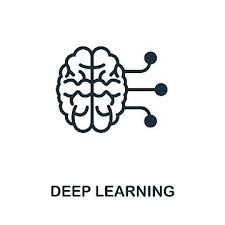

---
---

### 🤖 Natural Language Processing Tools:

  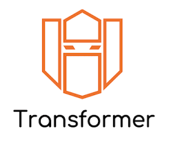
  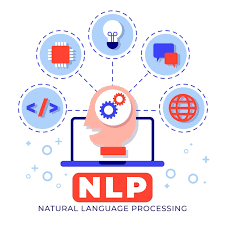

---
---

### 🤖 Gen AI and Agentic AI Tools:

  
  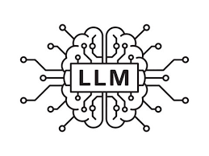
   
  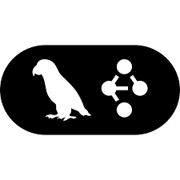
  
  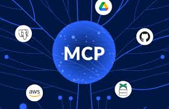
  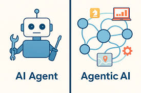
  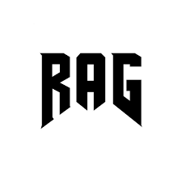

---
---

### 🤖 DevOps Tools:

  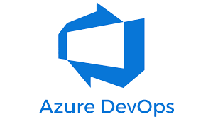
  

---
